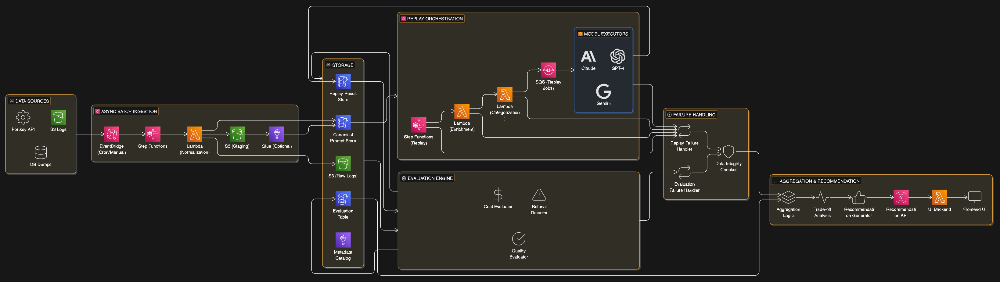
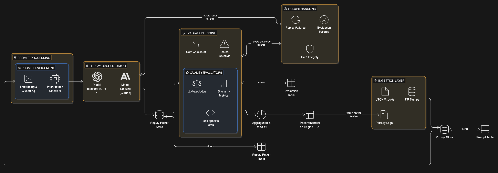

# Replay

**Measure. Compare. Decide.**

Replay helps you make data-driven model selection decisions by testing your actual prompts across different AI models and measuring what matters: cost, quality, and reliability.

---

## What Problem Does This Solve?

You're spending money on Model A, but would Model B work just as well for 40% less cost? 

You don't know because:
- You can't predict how models will perform on *your* specific use case
- Quality is subjective and hard to measure at scale
- Manual testing is slow and doesn't scale

**Replay solves this by running your historical prompts through different models and giving you empirical evidence.**

---

## How It Works
```
Your Historical Prompts
         ↓
   Test Across Models (GPT-4, Claude, Gemini etc.)
         ↓
   Measure Cost + Quality + Refusals
         ↓
   Get Actionable Recommendations
```

### Example Output
```
Recommendation: Switch creative writing prompts to Claude Sonnet

Expected savings: 42% ($1,240/month → $719/month)
Quality impact: -0.3 on 10-point scale
Refusal rate: No change
Confidence: High (based on 847 prompts)

Evidence: View sample comparisons →
```

---

## Key Features

### 📊 Empirical Evidence
No guessing. We replay your actual prompts and measure real results.

### 💰 Cost Tracking
Exact cost calculations per prompt, per model, with no approximations.

### 🎯 Quality Evaluation
AI-powered quality assessment with human-readable explanations.

### 🚫 Refusal Detection
Automatic detection when models decline to answer.

### 📈 Trade-off Analysis
See cost vs quality visualized. Find your optimal balance.

### 🔍 Category Insights
Automatic prompt categorization (coding, creative, Q&A, etc.) for targeted recommendations.

### 🎛️ What-If Scenarios
Simulate different routing strategies before committing.

---

Batch processing automatically handles rate limits and retries.

### View Results
```bash
# Launch Real-time model switch with explanation context
streamlit run streamlit_chat.py
```
---

**Requirements:**
- Python 3.9+
- Portkey API keys for models you want to test
- Historical prompt data (JSON or Portkey format) (We used open-source dataset [lmsys/lmsys-chat-1m](https://huggingface.co/datasets/lmsys/lmsys-chat-1) )

---

## Data Format

Your input data should include:
```json
{
  "prompt": "Write a Python function to...",
  "response": "Here's the function...",
  "model": "gpt-4",
  "tokens_in": 45,
  "tokens_out": 120,
  "timestamp": "2024-01-15T10:30:00Z"
}
```

Replay automatically extracts and normalizes this from Portkey logs.

---

## Use Cases

### 🔄 Model Migration
Planning to switch from GPT-4 to a cheaper alternative? Test first.

### 💡 Cost Optimization
Find which prompt categories can use cheaper models without quality loss.

### 🆕 New Model Evaluation
New model released? See how it performs on your workload.

### 📉 Quality Monitoring
Track if model performance degrades over time.

### 🎯 Routing Strategy
Build intelligent routing: premium models for complex prompts, budget models for simple ones.

---

## Architecture Overview
```
Prompt Store → Replay Executor → Evaluation Engine → Recommendations
                     ↓                    ↓
                 (Multiple           (Cost, Quality,
                  Models)             Refusals)
```

**Design Materials:**

### System Design

### Process Design


---

## Limitations

**What Replay Is:**
- ✅ A measurement and comparison tool 
- ✅ Evidence for making decisions
- ✅ A way to validate model switches
- ✅ Real-time routing (use after analysis)

**What Replay Is Not:**
- ❌ A model training system

---

## License

MIT License - see LICENSE file for details

---

## Contributing

We welcome contributions! See CONTRIBUTING.md for guidelines.

---

**Built with clarity. Powered by evidence.**